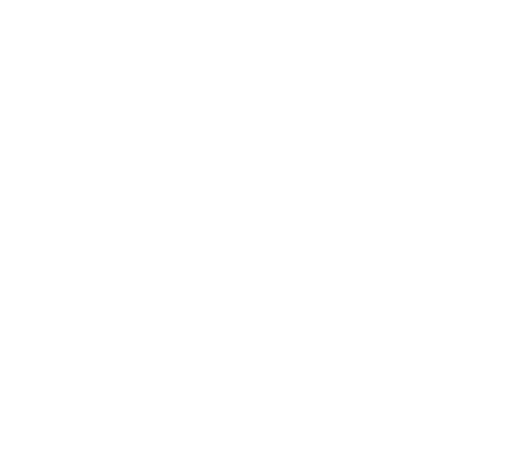
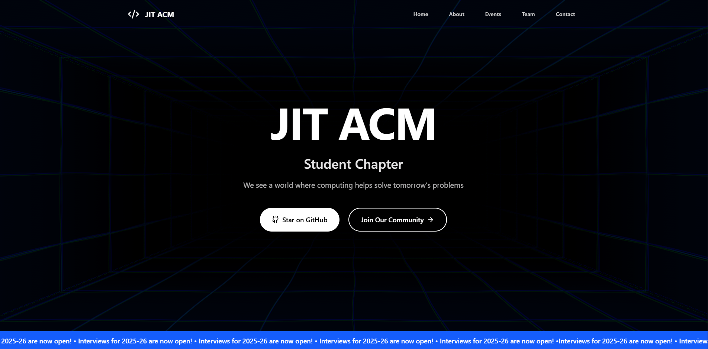

<div align="center">
	
	<h1>JIT ACM Official Website</h1>
	<p>
		<strong>The official website of the JIT ACM Student Chapter.</strong>
	</p>
	<p>
		<a href="#getting-started"><strong>Get Started</strong></a> ·
		<a href="#system-architecture"><strong>Architecture</strong></a> ·
		<a href="https://github.com/Walayhs/JIT-ACM-Offcial-Website"><strong>Repository</strong></a>
	</p>
	<p>
		
		
		
		
		
	</p>
</div>

<br />

<div align="center">
	
</div>

---

## Project Overview

The JIT-ACM website is a modern, animation-rich chapter platform designed to present events, team activities, blogs, sponsors, and chapter highlights in a clean and interactive user experience.

The project is currently built as a Next.js frontend application with reusable components and route-level pages.

| Layer | Technology | Description |
| :--- | :--- | :--- |
| **Web App** | [Next.js](https://nextjs.org/) + [React](https://react.dev/) | Page-based routing and component-driven UI architecture. |
| **Styling** | [Tailwind CSS](https://tailwindcss.com/) + custom CSS + [Shadcn](https://ui.shadcn.com/) | Utility-first styling with custom visual sections and typography. |
| **Animation & 3D** | [Framer Motion](https://www.framer.com/motion/), [GSAP](https://gsap.com/), [Three.js](https://threejs.org/) | Interactive effects, transitions, and 3D visual experiences. |
| **Tooling** | ESLint + TypeScript | Code quality and type-safe development workflow. |

---

## System Architecture

This repository is a single web application codebase with route components under `src/pages` and reusable sections under `src/components`.

### Directory Structure

```text
JIT-ACM-Offcial-Website/
|- public/                    # Static assets (images, event media, sponsors)
|  |- eventP/
|  |- images/
|  |- Sponsor/
|- src/
|  |- components/             # Reusable UI sections (Hero, Navbar, Events, etc.)
|  |- lib/                    # Utility helpers
|  |- pages/                  # Route-level pages
|  |- styles/                 # Font and custom stylesheet files
|  |- types/                  # Type declarations
|  |- App.tsx                 # Main homepage composition
|  |- index.css               # Global styles
|  |- main.tsx                # Legacy Vite entry file
|- next.config.js             # Next.js configuration
|- vite.config.ts             # Legacy Vite configuration kept in repo
|- tailwind.config.js         # Tailwind configuration
|- postcss.config.js          # PostCSS configuration
|- eslint.config.js           # ESLint configuration
```

### Key Architectural Patterns

- **Component-Driven Sections (`src/components`)**: Homepage and feature sections are split into focused reusable components.
- **Route-Level Screens (`src/pages`)**: Event and blog flows are represented as independent pages for direct navigation.
- **Animation-First UX**: Motion and transition libraries are integrated across sections for a high-engagement UI.
- **Hybrid Migration State**: The active scripts run Next.js, while Vite files are retained from an earlier setup.

---

## Prerequisites

Ensure the following tools are installed:

- **Node.js**: v20 or higher (v22 recommended)
- **npm**: v10 or higher

---

## Getting Started

### 1. Clone the Repository

```bash
git clone https://github.com/Walayhs/JIT-ACM-Offcial-Website.git
cd JIT-ACM-Offcial-Website
```

### 2. Install Dependencies

```bash
npm install
```

### 3. Run Development Server

```bash
npm run dev
```

Open `http://localhost:3000` in your browser.

---

## Development Workflow

Use these commands during development:

```bash
# Start local development server
npm run dev

# Build production bundle
npm run build

# Run production server locally
npm run start

# Run lint checks
npm run lint
```

### Main Routes

- `/` - Home page
- `/EventDetails?id=<event-id>` - Event details
- `/EventRegistration?id=<event-id>` - Event registration form
- `/EventTicket?id=<event-id>` - Ticket generation view
- `/BlogPage?id=<blog-id>` - Blog detail page

---

## Contributing Guidelines

> **Restricted Access:** Contribution to this repository is reserved for official members of the JIT-ACM Student Chapter unless otherwise approved by the maintainers.

1. Check existing issues before starting a task.
2. Create a branch for your work (`feature/your-feature-name`).
3. Follow linting and project conventions.
4. Open a pull request with a clear change summary and screenshots for UI updates.

---

<div align="center">
	<p>&copy; 2026 JIT-ACM Student Chapter. All rights reserved.</p>
</div>
